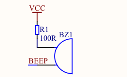

# BUZZER

O objetivo do programa é criar algo semelhante a um alarme.

O buzzer mostrado no diagrama a seguir está conectado no pino cujo endereço é 95h.

Sendo assim, na linha 3, declaramos a variável beep associada ao valor 0x95.

Na linha 5, a função sleep manterá o microcontrolador ocupado por algum tempo.

Inicialmente, dentro da função main, a variável beep é inicializada com o valor 0.

Em seguida, o laço while mantém o programa sempre em execução.

No corpo do laço while, temos a lógica responsável por fazer o buzzer funcionar.

Quando alteramos seu estado entre 0 e 1, ele emitirá um beep. Dessa forma, quando alternamos o estado dele entre 0 e 1 em intervalos regulares, o resultado será um som similar ao de um alarme.

Essa alternância é feita dentro do laço for, na linha 18, quando o valor de beep é invertido usando o operador **!**.

O fim do laço é seguido de uma pausa e depois tudo recomeça.

## Sobre a função sleep

Como mencionado, a função sleep é utilizada para criarmos uma espécie de pausa durante a execução do programa. Embora o valor recebido como argumento não seja necessariamente uma unidade relacionada a tempo (s, ms, us...).

O procedimento a seguir ilustra uma maneira de termos uma noção do tempo mínimo que será necessário para executá-la.

Primeiro, verificamos as informações do microcontrolador no datasheet:

Na seção de features (página 4), obtemos a seguinte informação:

1. Enhanced 80C51 Central Processing Unit, 6T or 12T per machine cycle
2. Operation frequency range: 0- 48MHz@12T, or 0-24MHz@6T

No primeiro item, é dito que a CPU faz 6 ou 12 ciclos de clock para um ciclo de máquina.

Já no segundo item é informado que para ciclos de máquina de 6T tem-se uma frequência de 24MHz (2.4 \* 10^7 ciclos/s) e para ciclos de máquina de 12T tem-se 48MHz (4.8 \* 10^7 ciclos/s)

Note que esses valores indicam a faixa na qual o microcontrolador funciona. Na placa de desenvolvimento há um cristal que opera em 11,0592 MHz. Nesse caso, 11 MHz estão entre 0 e 24 MHz, onde o ciclo de máquina é de 6T.

Agora precisamos saber quais instruções são executadas pelo microcontrolador, em particular, o trecho "while(i--)", presente na função sleep.

O trecho de código em assembly gerado pelo SDCC é:

    ; while(i--)              N. ciclos de máquina, 6 * N ciclos de máquina
    mov	ar4,r6              ; 2, 12
    mov	ar5,r7              ; 2, 12
    dec	r6                  ; 1, 6
    cjne	r6,#0xff,00111$ ; 2, 12
    dec	r7                  ; 1, 6
    mov	a,r4                ; 1, 6
    orl	a,r5                ; 1, 6
    jnz	00101$              ; 2, 12

Uma observação sobre o código acima é que ele não corresponde ao que de fato é executado pelo microcontrolador, embora seja provavelmente parecido com isso.

Com essas informações e tomando como exemplo o trecho de código "sleep(50000)" verificamos que:

O número de ciclos feitos em cada iteração do laço é de **72** ou (12 + 12 + 6 + 12 + 6 + 6 + 6 + 12).

Sendo assim, 50.000 iterações corresponderão a 72 * 50.000, que é igual a **3.600.000** ciclos.

Então, se o cristal opera a 11 MHz, o tempo necessário é obtido dividindo-se 3.600.000 por 11 MHz.

3.600.000 / 11.059.200 = ~**0.3255**

Já que a frequência é dada em ciclos por segundo, a unidade do resultado também será dada em segundos.

Concluindo, para a função sleep ser executada 50.000 vezes será necessário no mínimo 325.5 ms.
