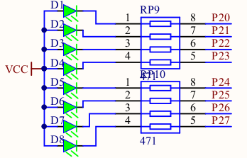

# LED

O objetivo do programa é ligar sequencialmente cada um dos oito leds.

Primeiramente, é definido o local onde cada led está.
Para isso, declaramos da linha 3 até a 9, em main.c, que:

- O LED **0** está no endereço **0xA0**
- O LED **1** está no endereço **0xA1**
- O LED **2** está no endereço **0xA2**
- O LED **3** está no endereço **0xA3**
- O LED **4** está no endereço **0xA4**
- O LED **5** está no endereço **0xA5**
- O LED **6** está no endereço **0xA6**
- O LED **7** está no endereço **0xA7**

Cada endereço corresponde a um bit do registrador P2.

_Mais informações sobre cada endereço podem ser consultadas na página 32 do [datasheet](../datasheet.pdf)_

Da linha 12 até a 17, é criada uma função cujo objetivo é manter o microcontrolador ocupado durante algum tempo. Isso evita que todos os leds aparentem estarem ligados simultaneamente.

Na função main o laço while é necessário para manter o programa sempre em execução.

Internamente ao while, o laço for faz a contagem de 0 até 7 (já que existem 8 leds).

Dentro do laço for, encontra-se a lógica para ligar e desligar cada led.

Na linha 25 é realizada uma operação de deslocamento do bit menos significativo do valor 1. O resultado desse deslocamento indicará qual led será ligado.

Após isso, é atribuído 1 a todas as variáveis relacionadas aos leds, para ficarem todos desligados.

Em seguida, o led correspondente ao índice i no laço for é ligado. Para ligar o led, usamos o **AND** entre um determinado valor e o resultado da operação de deslocamento anterior. Em seguida, precisamos deixar o valor em baixo, então o operador lógico de inversão **!** é utilizado.

### Exemplo quando i = 5:

Índice = 101b

Deslocamento = 100000b

EstadoLED = NOT (Deslocamento AND Valor)

**LED 4**

    NOT (00100000b AND 00010000b) =

    NOT 0b =

    1b (Desligado)

**LED 5**

    NOT (00100000b AND 00100000b) =

    NOT 00100000b =

    0b (Ligado)
